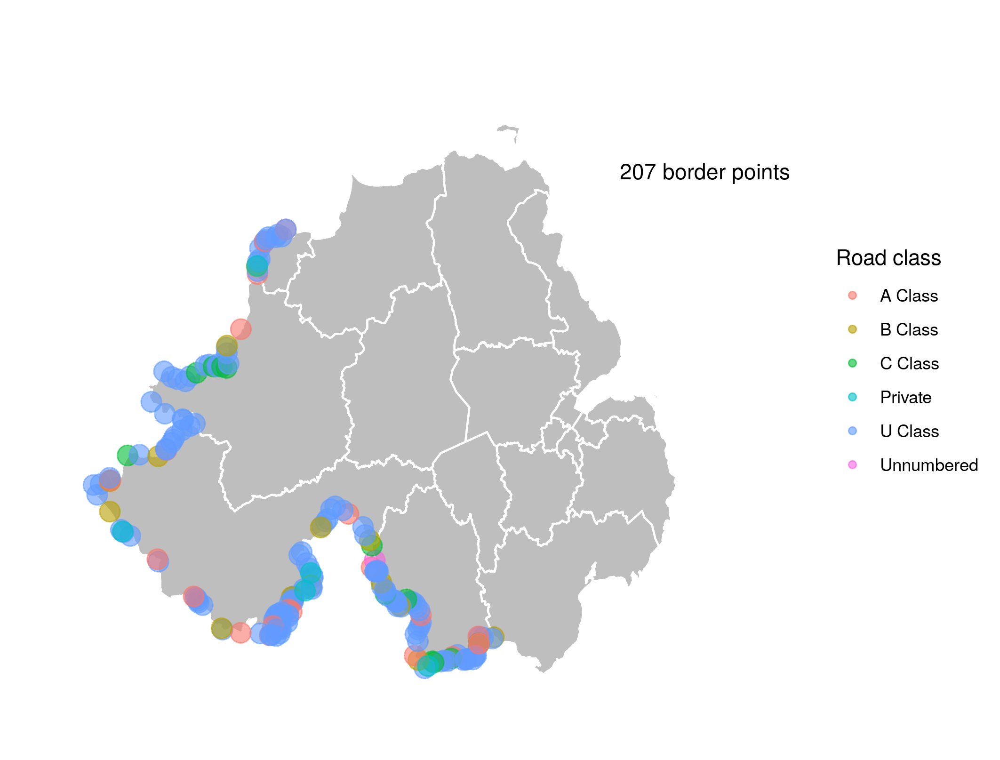

# NI Border Crossings

## Overview

A small repository that counts and maps all border crossings between Ireland and Northern Ireland by road type. Written in `R`.

## Contact

The best way to troubleshoot or ask for a new feature or enhancement is to create a Github [issue](https://github.com/cbi-ni/ni-border-crossings/issues). However, if you have any further questions you can contact [me](mailto:owen.sims@cbi.org.uk) directly.
